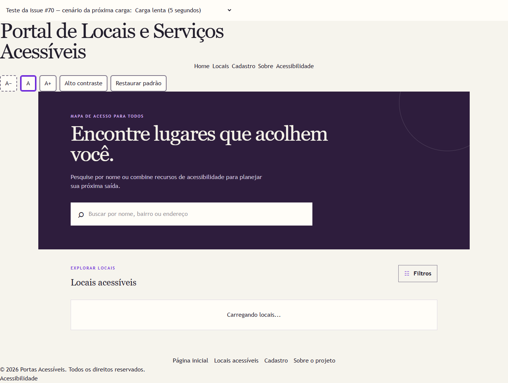
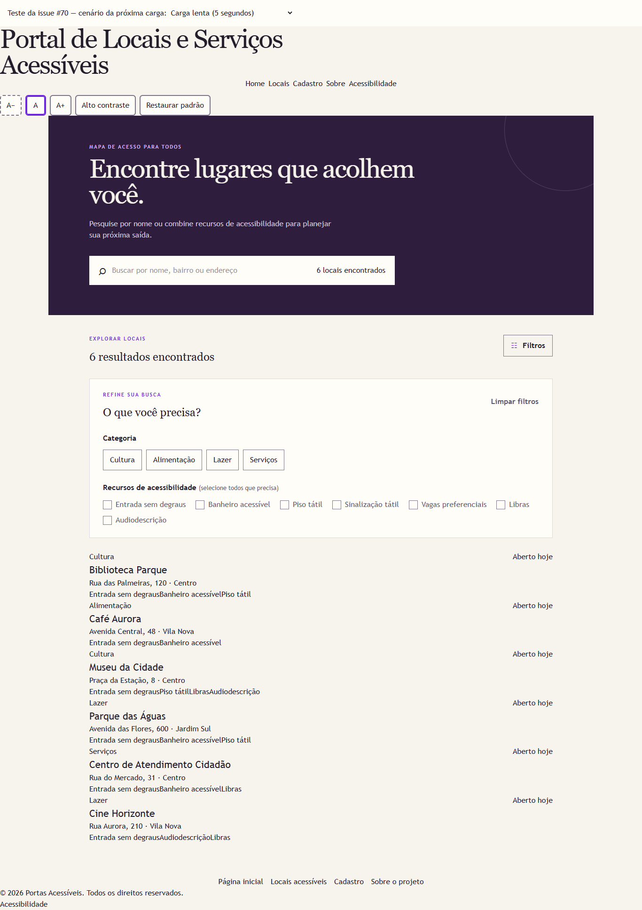
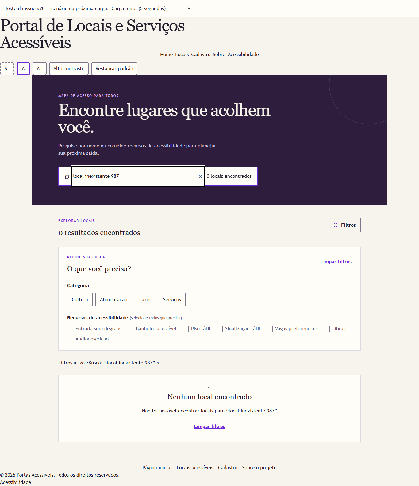
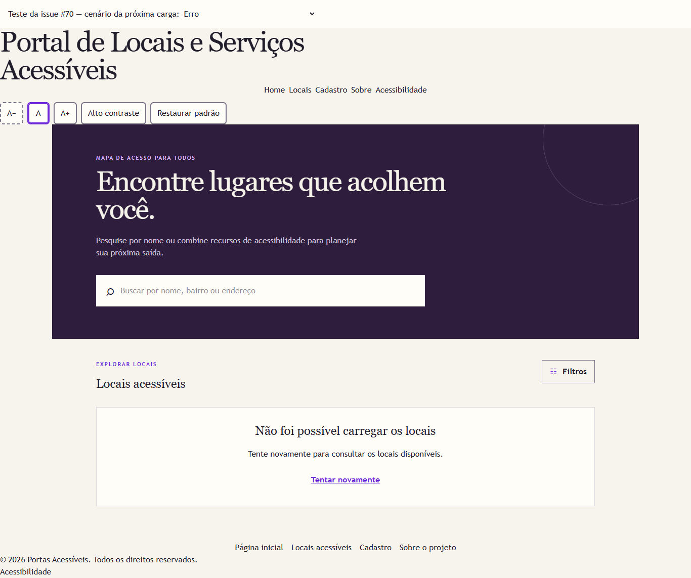
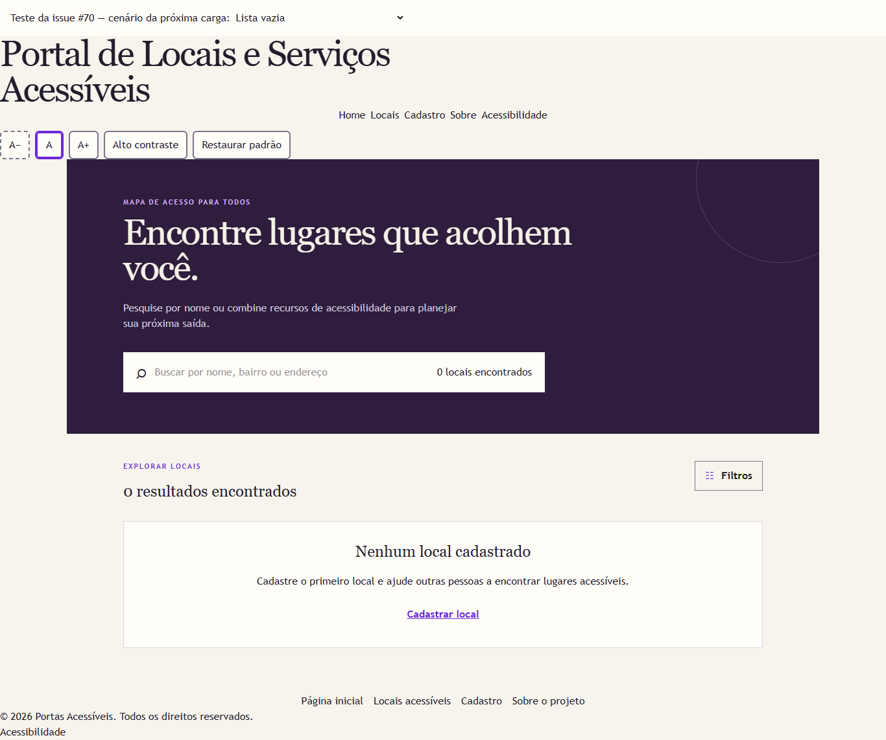
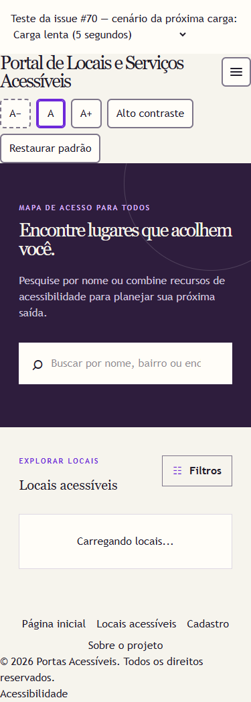
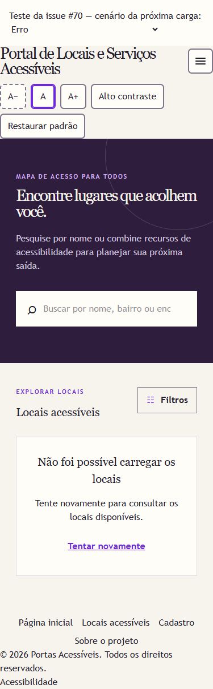
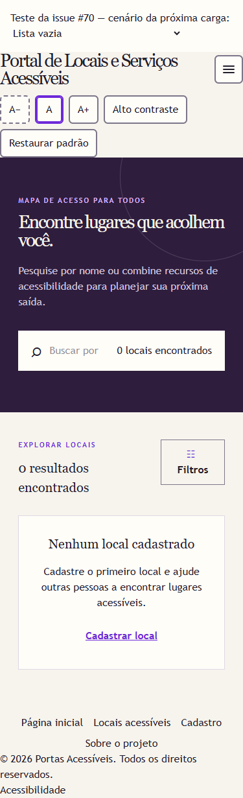

# Issue #70 — estados da listagem

Verificações do autor em 06/10/2026. Este registro acompanha a implementação;
a revisão técnica e a decisão do QA permanecem pendentes.

## Implementação

`carregarLocais(): Promise<Local[]>` simula 500 ms de espera e entrega cópias
dos locais e dos recursos de `src/data/locais.ts`. O Provider começa vazio,
expõe `carregando`, `pronto` e `erro`, permite repetir a tentativa e ignora
respostas de efeitos desmontados. O cadastro aguarda a carga para conferir
duplicidades e gerar o ID sem ser sobrescrito pela resposta inicial.

Na listagem, uma região fixa `output` com `aria-live="polite"` informa a carga,
e uma região fixa `role="alert"` informa falhas. Os contadores só recebem
conteúdo em `pronto`. A lista vazia oferece o link `/cadastrar`; uma busca
sem correspondência mantém a opção de limpar filtros.

## Reproduzir os estados

```sh
npm ci
npm run dev -- --host 127.0.0.1 --port 5173 --strictPort
```

| Cenário | URL local | Resultado esperado |
| --- | --- | --- |
| Portal | `http://127.0.0.1:5173/locais` | Carga de 500 ms, depois 6 locais |
| Carga lenta | `http://127.0.0.1:5173/tests/fixtures/locais.html?cenario=carregando` | Texto de carga, sem contador, depois dados |
| Erro | `http://127.0.0.1:5173/tests/fixtures/locais.html?cenario=erro` | Mensagem e botão Tentar novamente |
| Lista vazia | `http://127.0.0.1:5173/tests/fixtures/locais.html?cenario=vazio` | Nenhum local cadastrado e link ao cadastro |
| Busca vazia | `http://127.0.0.1:5173/tests/fixtures/locais.html` | Buscar `local inexistente 987`: Nenhum local encontrado |
| Cadastro durante carga | `http://127.0.0.1:5173/tests/fixtures/locais.html?cenario=carregando&rota=/cadastrar` | Envio desabilitado até a carga terminar |
| Cadastro após falha | `http://127.0.0.1:5173/tests/fixtures/locais.html?cenario=erro&rota=/cadastrar` | Envio desabilitado e link à listagem para tentar novamente |
| Falha obsoleta | `http://127.0.0.1:5173/tests/fixtures/locais.html?cenario=erro-obsoleto` | Após 2 s, a falha do primeiro efeito não substitui o sucesso |
| Lista obsoleta | `http://127.0.0.1:5173/tests/fixtures/locais.html?cenario=vazio-obsoleto` | Após 2 s, a lista vazia do primeiro efeito não substitui os 6 locais |

Para recuperar uma falha, abra o cenário de erro, selecione **Com dados** no
controle de teste e acione **Tentar novamente**. Trocar a seleção prepara
somente a próxima carga: não dispara uma recarga nem remonta o Provider.
Também é possível manter **Erro** para conferir uma segunda falha.

A fixture injeta uma função de carga e usa os mesmos Provider, layout, rotas
e páginas do portal, dentro de `StrictMode`. A primeira chamada dos cenários
obsoletos responde depois da segunda. Esses controles pertencem exclusivamente
à entrada de teste: o build usa `index.html` e não publica a fixture.

## Verificações realizadas

- `npm run lint`: sem erros ou avisos.
- `npm run build`: TypeScript e Vite aprovados.
- `npm test`: 17 testes aprovados, incluindo 3 testes novos do serviço.
- Chromium headless via Playwright: carga, dados, busca vazia, filtros,
  falha e recuperação com Shift+Tab, Tab e Enter; foco visível no botão.
- Lista vazia e navegação ao cadastro; cadastro impedido durante carga ou
  falha; cadastro após carga mantém os 6 locais iniciais e acrescenta o sétimo.
- StrictMode: falhas e listas vazias de efeitos descartados não mudam o estado.
- Estados de carga, erro e lista vazia sem rolagem horizontal em 375 px.
- Rota real `/locais` com 6 itens e sem controles de teste.
- Nenhum erro JavaScript observado nos cenários executados.

As regiões de anúncio foram verificadas no DOM. A leitura com um leitor de
tela real deve ser conferida pelo QA; não foi simulada uma aprovação humana.

### Automação opcional de navegador

O teste do serviço faz parte de `npm test` e da CI. A suíte de navegador
é separada e requer Playwright disponível no ambiente. Para executá-la sem
alterar o manifesto ou o lockfile do projeto, em um clone de teste:

```sh
npm install --no-save --package-lock=false playwright
npx playwright install chromium
# Com o Vite já iniciado em outro terminal:
node tests/browser/estados-locais.cjs --saida work/issue70
```

O script aceita `--playwright` com o caminho de um módulo já instalado,
`--chromium` com o executável do navegador e `--base-url` para outra porta.
As capturas são gravadas na pasta indicada por `--saida`.

## Evidências

As capturas abaixo usam a fixture de teste; a faixa superior identifica o
cenário simulado. Os arquivos de saída dos comandos estão nesta pasta.

- [Saída do lint](lint.txt)
- [Saída do build](build.txt)
- [Saída dos testes unitários](test.txt)
- [Saída da verificação no navegador](browser.txt)










## Integração

A branch foi conferida com `origin/develop` antes da abertura do PR. As demais
issues que alteram o Provider precisam preservar o estado e o descarte de
respostas. A página de detalhe da issue #67 ainda não está nesta base; quando
integrada, precisa aguardar `pronto` antes de indicar local inexistente.

O material [CodeLabs do professor](https://alecarlosjesus.github.io/aula-code-labs/)
foi usado como apoio. A carga assíncrona simulada atende ao escopo específico
da issue #70, enquanto os dados permanecem no arquivo TypeScript local.
